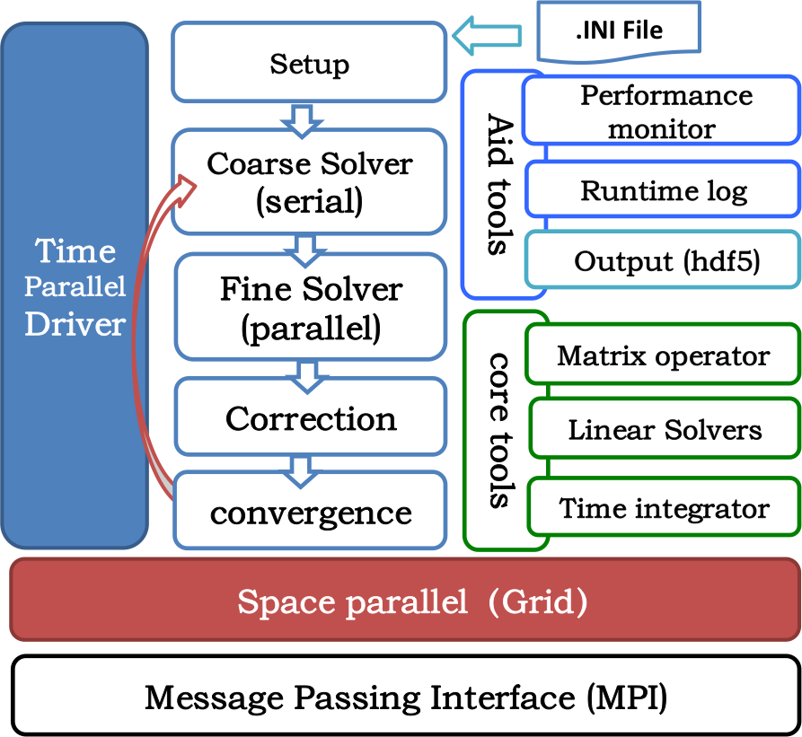

# PinT-TF : PinT Testing Framework

A performance and convergency testing framework for Parallel-in-Time methods, especially for [Parareal](https://en.wikipedia.org/wiki/Parareal).

## Description

The framework is heavily inspired by Seigo Imamura's master dissertation *"Hybrid-Parallel Performance Evaluation of Domain Decomposition and Parareal methods for Diffusion Problem"* at Kobe University, Japan. It aims at facilitating the performance test of time-space hybrid parallel methodology in massive scientific computing or numerical simulation domain, especially Parareal,which is obtained more and more attention and research in the recent ten years since it was fully introduced by Martin J. Gander and Stefan Vandewalle in their paper *"analysis of the parareal time-parallel time-integration method"* at 2007.

The framework has implemented the **Parareal algorithm skeleton** in an uniform mesh, and also a linear system solver based on biconjugate gradient stabilized method, for running a test, the users only need to provide problem-specific stencil code, for example, the 2D heat equation's 5-point stencil. All the parameters controlling the time-space domain division, convergency, time-step etc. can be  predefined through an .INI file, easily be changed and tuned. If the default funtionality of it cannot be able to support some specific problem, it can be easily be extended by writting a new implementation in problem-specific sub classes. 

The framework is mainly written by C++ for good template and extension, most BLAS related calculations is performed by Fortran for performance reason and easy matrix manipulation. It is very light-weight, the only third library it used is [inih](https://github.com/benhoyt/inih), a small but excellent .INI file parser. 

At the current stage, all the 1D / 2D / 3D can be automatically supported, we use the [PMlib](https://github.com/avr-aics-riken/PMlib) as the performance moniter, but PMlib will not be activated until the compile option ```-D _PMLIB_``` is used.

## Design and implementation 
<p align="center"></img></p>

There are five main objects and other two auxiliary objects in the framework.
- **PinT**: for ini configuration, see the pint.ini sample file for details

- **Grid**: space parallel manager, manages the uniform mesh, holds the physical variables, iniializes variables and applys boundary conditions, synchonizes guard cells, outputs result, and so on. 

- **Driver**: time parallel manager, and the driver of the PinT process. it implements the Parareal algorithm, and controls the execution flow of the program, especially the time parallel flow. The core function of the Driver is evolve(), it provides the template of Parareal algorithm, and drives the problem-specific coarse/fine solvers to evolve along the time slices within the whole time domain.    

- **Solver**: the abstract interface of coarse/fine solvers used by Parareal method, perform the time integration over one time slice. Its most imporant sub class is NewtonSolver, which implemented the template of Newton-Raphson method for nonlinear system like Allen-Cahn equation. 

- **LS**: the abstract interface of linear solvers used by the coarse/fine solver, two linear solvers are provided in the current release. 
  - the most imporant solver is PBiCGStab which implemented the [biconjugate gradient stabilized method](https://en.wikipedia.org/wiki/Biconjugate_gradient_stabilized_method). 
  - Red-Black [SOR](https://en.wikipedia.org/wiki/Successive_over-relaxation) solver is also provided, but it is less efficient than BiCG according to our experiments.

- Output : outputs the grid variables for debugging, ASCII format is supported for small runnings. HDF5 output is now supported for dumping out large data, but not well tuned in current, '.h5' file includes two datasets, one is a 2d array for N*3 coordinates  and the other is 1d array for N solution variables, where N is the total grid cellls. 

- Monitor: a simple wrapper of PMLib for easily open or close the profiling function.

## DEMO

For example, [1D/2D/3D heat equation](https://commons.wikimedia.org/wiki/File:Heatequation_exampleB.gif), sample codes are under the src/heat directory.

1. establishs a grid (HeatGrid) for heat diffuse problem, the main and only task is to set the initial value to variables. 

```c++
HeatGrid::HeatGrid(PinT *conf) : Grid(conf){ } 

void HeatGrid::init(){
    long ind = 0;
    double x, unk;
    for(int i = nguard; i<nx+nguard ; i++){
        ind = i;
        x = this->getX(ind);   // get the global coordinates of the cell
        unk = cos(2*x);        // set the initial temperature
        grid->set_val4all(ind,unk);  // set the variables used by Parareal method 
    }
}
```
2. creates a sub class (HeatSolver) of the **Solver**, provides the RHS and stencil matrix, and choose a linear solver to perform time integration, the sample code uses the classic [Crank–Nicolson method](https://en.wikipedia.org/wiki/Crank%E2%80%93Nicolson_method) for deducing the stencil of heat equation.

```c++
// set diffuse coefficient and tune the default parameter, problem specific
void HeatSolver::setup(){
    this->eps = 1.0e-6;  // change the default value of the super class
    k = 0.061644;        // diffuse coefficient 
}

// set diffuse coefficient and tune the default parameter, problem specific
void HeatSolver::setup(){
    if(ndim==1) k = 0.061644; 
    hypre = new PBiCGStab(conf, grid); // choose a linear solver
}

// evolve along one time slice for Crank-Nicolson method  
void HeatSolver::evolve() {
     
    // step0: set initial value, 
    soln = getSoln();     

    for(int i=0; i<steps; i++){
        // step1 : set boundary condition, default bc function provided by Grid is enough
        grid->bc(soln);
        
        // step2 : calcaluate RHS, the b of Ax=b 
        rhs();

        // step3 : set / update the stencil struct matrix, the A of Ax=b 
        stencil();

        // step4 : call the linear solver 
        hypre->solve(soln, b, A);

        // step5: update solution, 
    }
}

```

The calculations of RHS and stencil matrix are performed by Fortran.
**NOTE** : 
For the Heat equation with a constant diffuse factor or other simple examples, the coefficients of each stencil for different grid point may be same at the entire grid during the whole execution, so it is not necessary to use a LARGE matrix to hold these coefficients. 
 
BUT in practice, for real world simulations, the coefficients associated with each stencil entry will typically vary from gridpoint to gridpoint, so the caller must provide both the RHS(b) and stencil struct matrix(A) 

```fortran

!! calcaluate the RHS of Ax=b 
subroutine rhs_heat_1d(nxyz, lamdaxyz, ng, soln, b)
implicit none
    integer, dimension(3) :: nxyz
    real   , dimension(3) :: lamdaxyz
    integer ::  ng, i, ix 
    real    ::  lamdax 
    real, dimension(      1-ng:nxyz(1)+ng ) :: soln, b  

    ix = nxyz(1)
    lamdax = lamdaxyz(1)
    do i=1, ix
        b(i) =  lamdax/2 * ( soln(i+1) + soln(i-1) ) &
            + (1 - lamdax)*soln(i) 
    end do
end subroutine rhs_heat_1d

!! calcaluate the stencil struct matrix (A)
subroutine stencil_heat_1d(nxyz, lamdaxyz, ng, soln, A)
implicit none
    integer, dimension(3) :: nxyz
    real,    dimension(3) :: lamdaxyz 
    real    :: lamdax
    integer ::  ng, i, ix 
    real, dimension(      1-ng:nxyz(1)+ng ) :: soln  
    real, dimension(1:3,  1-ng:nxyz(1)+ng ) :: A 

    ix = nxyz(1)
    lamdax = lamdaxyz(1)
    do i=1, ix
        A(1, i) = -0.5*lamdax
        A(2, i) = -0.5*lamdax
        A(3, i) = 1 + lamdax
    end do
end subroutine stencil_heat_1d 

```

3. defines fine/coarse solver based on the HeatSolver, and the fine and coarse solver is not necessary to use the same linear solver and time integrating method. For the Fine and Coarse solver, the only thing is to set their specific variables in most cases. 

```c++
HeatSolverF::HeatSolverF(PinT *conf, Grid *g):HeatSolver(conf,g, true) {
    lamda = k * conf->f_dt / (2*g->dx*g->dx); // provides the lamda's value
}

HeatSolverC::HeatSolverC(PinT *conf, Grid *g):HeatSolver(conf,g, false){
    lamda = k * conf->c_dt / (2*g->dx*g->dx);
}
```

4. combines the HeatGrid and the fine/coarse solver in the main program.

```c++
int main(int argc, char* argv[]) {
    
    //load global configuration and init MPI  
    Driver driver;
    driver.init(argc, argv);

    // get init-ready system information
    PinT* conf = PinT::instance();

    // create and init the grid/mesh and solver 
    Grid *g = new HeatGrid(conf);
    g->init();
    Solver *F = new HeatSolverF(conf,g);   // fine solver 
    Solver *G = new HeatSolverC(conf,g);   // coarse solver

    // run the parareal algorithm 
    driver.evolve(g, G, F);

    // output result to disk for debug or post-processing, the two steps is not necessary for performance test. 
    g->output_local(g->u_end, false); // for each process, it will create a unique file
    g->output_global_h5("heat");  // aggregates the result from all the process, and dumps out to hdf5 file.
    
    driver.finalize();  // quit MPI 

    delete F;  
    delete G;
    delete g;  //free memory

    return 0;
}

```
5. changes the .ini file according to the real run time envirement and the test request. For better performance, ```pipelined mode```  can be activated by setting ```pipelined=1```,  See pint.ini sample for details, and the .INI file is very direct and simple. 


From the above sample codes, in most cases it is not necessary for users to care many boilerplate tasks explicitly such managing MPI envirement, mesh division, guard cell synchonization etc. The framework can perform most housekeeping tasks well, so users can focus on phyical moddel or problem itself as shown in the following picture.

<p align="center"></img></p>


For more comprehensive examples and usages, please check the 'pfm' directory. PFM stands for Phase Field Model, we implemented two solvers for a simplied  Allen-Cahn equation. All 1D/2D/3D are supported, OpenMP is also used to accelerate matrix calculations further in multi-core envirement.  Examples for customized boundary condition and problem-specific configuration are also located in 'pfm'.

## Build

* The Makefile is very simple, you can easily adapt it to any Unix-like OS.
* If using profiling, it is necessary to build PMLib firstly following [its website](https://github.com/avr-aics-riken/PMlib), and use the compile option ```-D _PMLIB_``` to activate it. PMLib needs both of MPI and OpenMP libraries. 
* Floating-point data type is DOUBLE, single precision is not supported, when compling Fortran code, it is recommended to set the default real type to 8 byte wide, if using gfortran, the option is -fdefault-real-8. 
* HDF5 output is also supported, using the compile option ```-D _HDF5_``` to activate the function, and make sure the hdf5 library is already installed.   
* In order to easily compile PMLib and hdf5, the Makefile can also accept commond line parameters.
  * for MPLib: ```$make _PMLIB_=1```
  * for HDF5 : ```$make _HDF5_=1```

* In order to support multi physical models easily, we also use optional flag to choose which model to be compiled.
  * for heat diffuse: ```$make _HEAT_=1```
  * for Phase Field's Allen-Cahn equation: ```$make _PFM_=1```

## Notice 

The framework is designed for performance test originally, not for the high accuracy scientific computing or numerical simulations. There are not any assumptions about the measurement unit standard for all the physical variables used in the program. You must be careful to make sure the physical UNIT consistency for specific problem.  

In the current version, in order to make the framework usable as earlier as possible to verify our design ideas, no special get/set methods are provided for most grid variables and configuration parameters. You must be careful when directly changing these values in some cases.     

## My consideration about Parareal

1. It uses more system memory (perhaps 5 times) than the traditional pure space parallel methodology. 
2. In practice, for many real-world multi-physical simulations, it is hard to pack all the related solvers into Parareal algorithm framework. How to do ?   

